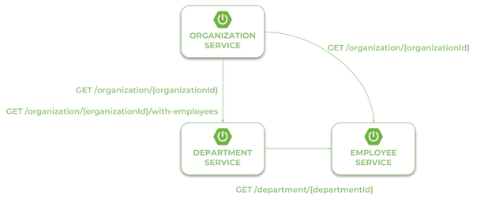
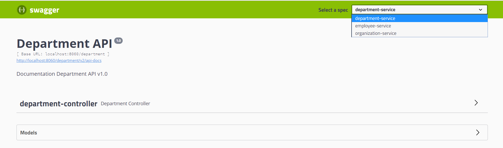

## Quick Guide to Microservices with Spring Boot 2.0, Eureka and Spring Cloud  [](https://twitter.com/piotr_minkowski)

Detailed description can be found here: [Quick Guide to Microservices with Spring Boot 2.0, Eureka and Spring Cloud](https://piotrminkowski.wordpress.com/2018/04/26/quick-guide-to-microservices-with-spring-boot-2-0-eureka-and-spring-cloud/) 

There are many articles on my blog about microservices with Spring Boot and Spring Cloud. The main purpose of this article is to provide a brief summary of the most important components provided by these frameworks that help you in creating microservices. The topics covered in this article are:

- Using Spring Boot 2.0 in cloud-native development
- Providing service discovery for all microservices with Spring Cloud Netflix Eureka
- Distributed configuration with Spring Cloud Config
- API Gateway pattern using a new project inside Spring Cloud: Spring Cloud Gateway
- Correlating logs with Spring Cloud Sleuth

Before we proceed to the source code, let's take a look at the following diagram. It illustrates the architecture of our sample system. We have three independent microservices, which register themselves in service discovery, fetch properties from the configuration service, and communicate with each other. The whole system is hidden behind an API gateway.


# Step 1. Building Configuration Server With Spring Cloud Config

By default, Spring Cloud Config Server stores the configuration data inside the Git repository. This is a very good choice in production mode, but for the sample file system backend, it will be enough. It is really easy to start with config server because we can place all the properties in the classpath. Spring Cloud Config by default search for property sources inside the following locations: ``classpath:/, classpath:/config, file:./, file:./config``.

We place all the property sources inside ``src/main/resources/config``. The YAML filename will be the same as the name of the service. For example, the YAML file for discovery-service will be located here: ``src/main/resources/config/discovery-service.yml``.

Two last important things. If you would like to start config server with a file system backend, you have to activate Spring Boot profile native. It may be achieved by setting the parameter ``--spring.profiles.active=native`` during application boot. I have also changed the default config server port (8888) to 8061 by setting the property server.port in the bootstrap.yml file.

# Sequence to start the Microservices

- config-service
- discovery-service
- employee-service
- organization-service
- department-service
- proxy-service


# Step 2. Building Service Discovery With Spring Cloud Netflix Eureka

More to the point of the configuration server. Now, all other applications, including discovery-service, need to add the spring-cloud-starter-config dependency in order to enable the config client. We also have to add the dependency to ``spring-cloud-starter-netflix-eureka-server``.

```yml
<?xml version="1.0" encoding="UTF-8"?>
<dependency>
   <groupId>org.springframework.cloud</groupId>
   <artifactId>spring-cloud-starter-netflix-eureka-server</artifactId>
</dependency>
```

Then you should enable running the embedded discovery server during application boot by setting the @EnableEurekaServer annotation on the main class.

```yml
@SpringBootApplication
@EnableEurekaServer
public class DiscoveryApplication {
 public static void main(String[] args) {
  new SpringApplicationBuilder(DiscoveryApplication.class).run(args);
 }
}
```

The application has to fetch a property source from the configuration server. The minimal configuration required on the client side is an application name and config server's connection settings.

```yml
spring:
  application:
    name: discovery-service
  cloud:
    config:
      uri: http://localhost:8088
```

As I have already mentioned, the configuration file discovery-service.yml should be placed inside the config-service module. However, I must say a few words about the configuration visible below. We have changed the Eureka running port from the default value (8761) to 8061. For a standalone Eureka instance, we have to disable registration and fetching registry.

```yml
server:
  port: 8061
eureka:
  instance:
    hostname: localhost
  client:
    registerWithEureka: false
    fetchRegistry: false
    serviceUrl:
      defaultZone: http://${eureka.instance.hostname}:${server.port}/eureka/
```

Now, when you are starting your application with the embedded Eureka server, you should see the following logs.

```
  .   ____          _            __ _ _
 /\\ / ___'_ __ _ _(_)_ __  __ _ \ \ \ \
( ( )\___ | '_ | '_| | '_ \/ _` | \ \ \ \
 \\/  ___)| |_)| | | | | || (_| |  ) ) ) )
  '  |____| .__|_| |_|_| |_\__, | / / / /
 =========|_|==============|___/=/_/_/_/
 :: Spring Boot ::        (v2.1.2.RELEASE)

2019-01-21 11:42:30.452  INFO 18084 --- [           main] c.c.c.ConfigServicePropertySourceLocator : Fetching config from server at : http://localhost:8088
2019-01-21 11:42:30.995  INFO 18084 --- [           main] c.c.c.ConfigServicePropertySourceLocator : Located environment: name=discovery-service, profiles=[default], label=null, version=null, state=null
2019-01-21 11:42:30.995  INFO 18084 --- [           main] b.c.PropertySourceBootstrapConfiguration : Located property source: CompositePropertySource {name='configService', propertySources=[MapPropertySource {name='classpath:/config/discovery-service.yml'}]}
2019-01-21 11:42:30.998  INFO 18084 --- [           main] p.p.s.DiscoveryServiceApplication        : No active profile set, falling back to default profiles: default
2019-01-21 11:42:31.500  WARN 18084 --- [           main] o.s.boot.actuate.endpoint.EndpointId     : Endpoint ID 'service-registry' contains invalid characters, please migrate to a valid format.
2019-01-21 11:42:31.654  INFO 18084 --- [           main] o.s.cloud.context.scope.GenericScope     : BeanFactory id=66e83739-5920-314b-b26d-edf014542642
2019-01-21 11:42:31.716  INFO 18084 --- [           main] trationDelegate$BeanPostProcessorChecker : Bean 'org.springframework.cloud.autoconfigure.ConfigurationPropertiesRebinderAutoConfiguration' of type [org.springframework.cloud.autoconfigure.ConfigurationPropertiesRebinderAutoConfiguration$$EnhancerBySpringCGLIB$$4b4f66a4] is not eligible for getting processed by all BeanPostProcessors (for example: not eligible for auto-proxying)
2019-01-21 11:42:31.945  INFO 18084 --- [           main] o.s.b.w.embedded.tomcat.TomcatWebServer  : Tomcat initialized with port(s): 8061 (http)
2019-01-21 11:42:31.962  INFO 18084 --- [           main] o.apache.catalina.core.StandardService   : Starting service [Tomcat]
2019-01-21 11:42:31.963  INFO 18084 --- [           main] org.apache.catalina.core.StandardEngine  : Starting Servlet engine: [Apache Tomcat/9.0.14]
2019-01-21 11:42:32.049  INFO 18084 --- [           main] o.a.catalina.core.AprLifecycleListener   : The APR based Apache Tomcat Native library which allows optimal performance in production environments was not found on the java.library.path: [C:\Softwares\Java\jdk1.8.0_171\jre\bin;C:\WINDOWS\Sun\Java\bin;C:\WINDOWS\system32;C:\WINDOWS;C:/Program Files/Java/jre1.8.0_191/bin/server;C:/Program Files/Java/jre1.8.0_191/bin;C:/Program Files/Java/jre1.8.0_191/lib/amd64;C:\Program Files (x86)\Common Files\Oracle\Java\javapath;C:\Program Files (x86)\RSA SecurID Token Common;C:\Program Files\RSA SecurID Token Common;C:\PROGRAM FILES\DMEXPRESS\PROGRAMS;C:\SOFTWARES\JAVA\JDK1.8.0_171\BIN;C:\ORACLE\PRODUCT\11.2.0\CLIENT_1\BIN;C:\WINDOWS\SYSTEM32;C:\WINDOWS;C:\WINDOWS\SYSTEM32\WBEM;C:\WINDOWS\SYSTEM32\WINDOWSPOWERSHELL\V1.0\;C:\WINDOWS\SYSTEM32\OPENSSH\;C:\PROGRAM FILES (X86)\PLANTRONICS\SPOKES3G\;C:\PROGRAM FILES\GIT\CMD;C:\SOFTWARES\APACHE-MAVEN-3.5.4\BIN;C:\PROGRAM FILES\NODEJS\;C:\USERS\E081155\APPDATA\ROAMING\NPM;C:\SOFTWARES\APACHE-ANT-1.10.5\BIN;C:\Softwares\mongodb-win32-x86_64-2008plus-ssl-4.0.3\bin;C:\Apache-Kafka\zookeeper-3.4.12\bin;C:\Program Files\TortoiseGit\bin;C:\Program Files\cURL\bin;C:\Program Files\RSA SecurID Token Common\;C:\Users\e081155\AppData\Roaming\Cloud Foundry;C:\Softwares\STS-3.9.5.RELEASE\sts-bundle\sts-3.9.5.RELEASE;;.]
2019-01-21 11:42:32.193  INFO 18084 --- [           main] o.a.c.c.C.[Tomcat].[localhost].[/]       : Initializing Spring embedded WebApplicationContext
2019-01-21 11:42:32.193  INFO 18084 --- [           main] o.s.web.context.ContextLoader            : Root WebApplicationContext: initialization completed in 1185 ms
2019-01-21 11:42:32.267  WARN 18084 --- [           main] c.n.c.sources.URLConfigurationSource     : No URLs will be polled as dynamic configuration sources.
2019-01-21 11:42:32.267  INFO 18084 --- [           main] c.n.c.sources.URLConfigurationSource     : To enable URLs as dynamic configuration sources, define System property archaius.configurationSource.additionalUrls or make config.properties available on classpath.
2019-01-21 11:42:32.276  INFO 18084 --- [           main] c.netflix.config.DynamicPropertyFactory  : DynamicPropertyFactory is initialized with configuration sources: com.netflix.config.ConcurrentCompositeConfiguration@53d13cd4
2019-01-21 11:42:33.032  INFO 18084 --- [           main] c.s.j.s.i.a.WebApplicationImpl           : Initiating Jersey application, version 'Jersey: 1.19.1 03/11/2016 02:08 PM'
2019-01-21 11:42:33.083  INFO 18084 --- [           main] c.n.d.provider.DiscoveryJerseyProvider   : Using JSON encoding codec LegacyJacksonJson
2019-01-21 11:42:33.084  INFO 18084 --- [           main] c.n.d.provider.DiscoveryJerseyProvider   : Using JSON decoding codec LegacyJacksonJson
2019-01-21 11:42:33.168  INFO 18084 --- [           main] c.n.d.provider.DiscoveryJerseyProvider   : Using XML encoding codec XStreamXml
2019-01-21 11:42:33.168  INFO 18084 --- [           main] c.n.d.provider.DiscoveryJerseyProvider   : Using XML decoding codec XStreamXml
2019-01-21 11:42:33.444  WARN 18084 --- [           main] c.n.c.sources.URLConfigurationSource     : No URLs will be polled as dynamic configuration sources.
2019-01-21 11:42:33.444  INFO 18084 --- [           main] c.n.c.sources.URLConfigurationSource     : To enable URLs as dynamic configuration sources, define System property archaius.configurationSource.additionalUrls or make config.properties available on classpath.
2019-01-21 11:42:33.596  INFO 18084 --- [           main] o.s.s.concurrent.ThreadPoolTaskExecutor  : Initializing ExecutorService 'applicationTaskExecutor'
2019-01-21 11:42:34.209  INFO 18084 --- [           main] o.s.c.n.eureka.InstanceInfoFactory       : Setting initial instance status as: STARTING
2019-01-21 11:42:34.231  INFO 18084 --- [           main] com.netflix.discovery.DiscoveryClient    : Initializing Eureka in region us-east-1
2019-01-21 11:42:34.231  INFO 18084 --- [           main] com.netflix.discovery.DiscoveryClient    : Client configured to neither register nor query for data.
2019-01-21 11:42:34.236  INFO 18084 --- [           main] com.netflix.discovery.DiscoveryClient    : Discovery Client initialized at timestamp 1548051154235 with initial instances count: 0
2019-01-21 11:42:34.265  INFO 18084 --- [           main] c.n.eureka.DefaultEurekaServerContext    : Initializing ...
2019-01-21 11:42:34.267  WARN 18084 --- [           main] c.n.eureka.cluster.PeerEurekaNodes       : The replica size seems to be empty. Check the route 53 DNS Registry
2019-01-21 11:42:34.281  INFO 18084 --- [           main] c.n.e.registry.AbstractInstanceRegistry  : Finished initializing remote region registries. All known remote regions: []
2019-01-21 11:42:34.281  INFO 18084 --- [           main] c.n.eureka.DefaultEurekaServerContext    : Initialized
2019-01-21 11:42:34.290  INFO 18084 --- [           main] o.s.b.a.e.web.EndpointLinksResolver      : Exposing 2 endpoint(s) beneath base path '/actuator'
2019-01-21 11:42:34.355  INFO 18084 --- [           main] o.s.c.n.e.s.EurekaServiceRegistry        : Registering application DISCOVERY-SERVICE with eureka with status UP
2019-01-21 11:42:34.357  INFO 18084 --- [      Thread-14] o.s.c.n.e.server.EurekaServerBootstrap   : Setting the eureka configuration..
2019-01-21 11:42:34.358  INFO 18084 --- [      Thread-14] o.s.c.n.e.server.EurekaServerBootstrap   : Eureka data center value eureka.datacenter is not set, defaulting to default
2019-01-21 11:42:34.358  INFO 18084 --- [      Thread-14] o.s.c.n.e.server.EurekaServerBootstrap   : Eureka environment value eureka.environment is not set, defaulting to test
2019-01-21 11:42:34.375  INFO 18084 --- [      Thread-14] o.s.c.n.e.server.EurekaServerBootstrap   : isAws returned false
2019-01-21 11:42:34.376  INFO 18084 --- [      Thread-14] o.s.c.n.e.server.EurekaServerBootstrap   : Initialized server context
2019-01-21 11:42:34.376  INFO 18084 --- [      Thread-14] c.n.e.r.PeerAwareInstanceRegistryImpl    : Got 1 instances from neighboring DS node
2019-01-21 11:42:34.376  INFO 18084 --- [      Thread-14] c.n.e.r.PeerAwareInstanceRegistryImpl    : Renew threshold is: 1
2019-01-21 11:42:34.376  INFO 18084 --- [      Thread-14] c.n.e.r.PeerAwareInstanceRegistryImpl    : Changing status to UP
2019-01-21 11:42:34.385  INFO 18084 --- [      Thread-14] e.s.EurekaServerInitializerConfiguration : Started Eureka Server
2019-01-21 11:42:34.399  INFO 18084 --- [           main] o.s.b.w.embedded.tomcat.TomcatWebServer  : Tomcat started on port(s): 8061 (http) with context path ''
2019-01-21 11:42:34.400  INFO 18084 --- [           main] .s.c.n.e.s.EurekaAutoServiceRegistration : Updating port to 8061
2019-01-21 11:42:34.401  INFO 18084 --- [           main] p.p.s.DiscoveryServiceApplication        : Started DiscoveryServiceApplication in 5.194 seconds (JVM running for 6.011)
```

# Step 3. Building a Microservice Using Spring Boot and Spring Cloud
Our microservice has to perform some operations during boot. It needs to fetch configuration from config-service, register itself in discovery-service, expose an HTTP API, and automatically generate API documentation. To enable all these mechanisms, we need to include some dependencies in pom.xml. To enable the config client, we should include the starter spring-cloud-starter-config. The discovery client will be enabled for the microservice after including spring-cloud-starter-netflix-eureka-client and annotating the main class with @EnableDiscoveryClient. To force the Spring Boot application to generate API documentation we should include the springfox-swagger2 dependency and add the annotation @EnableSwagger2.

The application has to fetch configuration from a remote server, so we should only provide a bootstrap.yml file with the service name and server URL. In fact, this is an example of the Config First Bootstrap approach, when an application first connects to a config server and takes a discovery server address from a remote property source. There is also Discovery First Bootstrap, where a config server address is fetched from a discovery server.

```yml
spring:
  application:
    name: employee-service
  cloud:
    config:
      uri: http://localhost:8088
```

There are not many configuration settings. Here's the application's configuration file stored on a remote server. It stores only the HTTP running port and Eureka URL. However, I also placed the file employee-service-instance2.yml on the remote config server. It sets a different HTTP port for application, so you can easily run two instances of the same service locally based on remote properties. Now, you may run the second instance of employee-service on port 9090 after passing the argument spring.profiles.active=instance2 during an application startup. With default settings, you will start the microservice on port 8090.


```
server:
  port: 9090
eureka:
  client:
    serviceUrl:
      defaultZone: http://localhost:8061/eureka/
```

# Step 4. Communication Between Microservices With Spring Cloud Open Feign
Our first microservice has been created and started. Now, we will add other microservices that communicate with each other. The following diagram illustrates the communication flow between three sample microservices: organization-service, department-service and employee-service. Microservice organization-service collect list of departments with ( ``GET /organization/{organizationId}/with-employees``) or without employees ( ``GET /organization/{organizationId}``) from department-service, and list of employees without dividing them into different departments directly from employee-service. Microservice department-service is able to collect a list of employees assigned to the particular department.




# Here's the Swagger UI 
for our sample microservices system, available under ``http://localhost:8060/swagger-ui.html``.



# Step 7. Running Applications
Let's take a look at the architecture of our system visible on the following diagram. We will discuss it from the organization-service point of view. After starting,organization-service connects to config-service available under the address localhost:8088 (1). Based on remote configuration settings, it is able to register itself in Eureka (2). When the endpoint of organization-service is invoked by an external client via the gateway (3) available under address localhost:8060, the request is forwarded to an instance of organization-service based on entries from service discovery (4). Then organization-service lookup for address of department-service in Eureka (5), and calls its endpoint (6). Finally, department-service calls the endpoint from employee-service. The request is load balanced between two available instances of employee-service by Ribbon (7).


Let's take a look at the Eureka Dashboard available under ``http://localhost:8061``. There are four instances of microservices registered there: a single instance of organization-service and department-service, and two instances of employee-service.


Now, let's call the endpoint ``http://localhost:8060/organization/1/with-departments-and-employees``.

```
{"id":1,"name":"Microsoft","address":"Redmond, Washington, USA","departments":[{"id":1,"name":"Development","employees":[{"id":1,"name":"John Smith","age":34,"position":"Analyst"},{"id":2,"name":"Darren Hamilton","age":37,"position":"Manager"},{"id":3,"name":"Tom Scott","age":26,"position":"Developer"}]},{"id":2,"name":"Operations","employees":[{"id":4,"name":"Anna London","age":39,"position":"Analyst"},{"id":5,"name":"Patrick Dempsey","age":27,"position":"Developer"}]}],"employees":[]}
```
